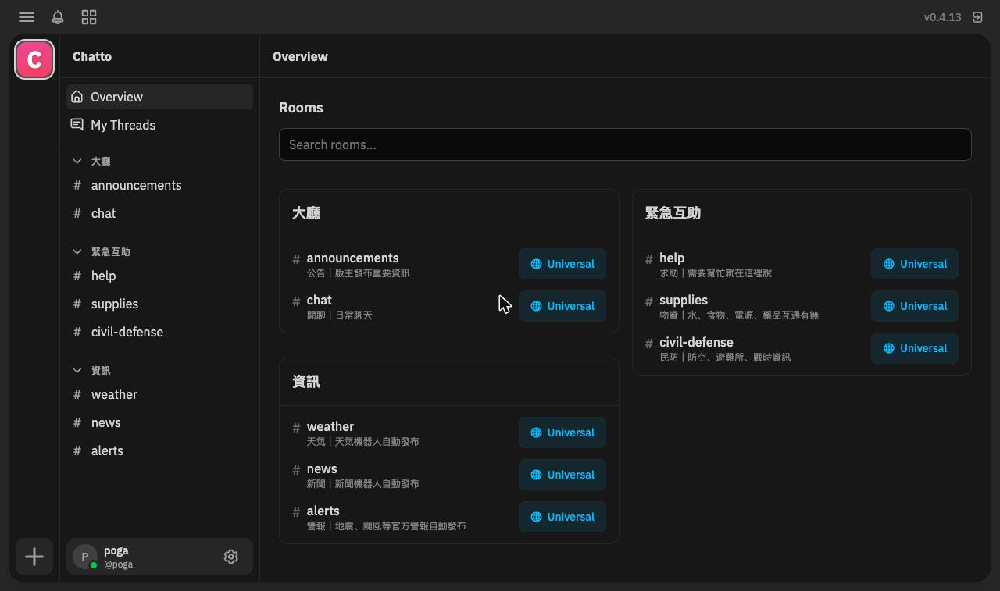
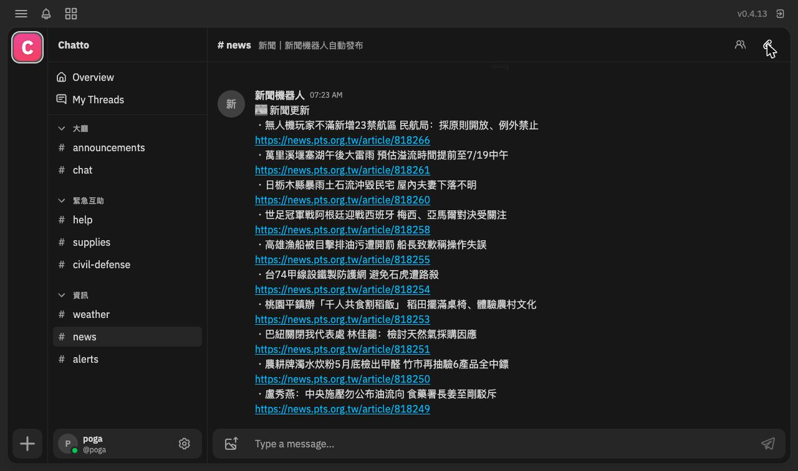

# Emergency Box

A chat room that lives on your wifi and keeps working when the internet dies.



## Install (once, needs internet)

Currently requires an Apple Silicon Mac with [Homebrew](https://brew.sh).

```bash
git clone <repo> && cd emergency-box && sudo ./install.sh
```

This installs caddy + chatto via brew, lays out `/opt/emergency-box`,
starts 4 always-on launchd services (they survive reboots), and creates
the chat admin account — credentials land in
`/opt/emergency-box/config/operator-credentials.txt`; save them.

**LLM-agent variant:** point your coding agent at this repo and say:
*follow README.md to install, then run the test suite.*

## Use it

- **Chat:** http://chat.local — **Sign up:** http://chat.local/join
- New people: join the wifi, open **chat.local**, tap **Create account**, pick a name and password, then **Sign in**.
- Old Android phones that can't resolve `.local`: use the QR / plain-IP fallback (`http://<mac-ip>/join`) printed on the sign ([docs/sign.md](docs/sign.md)) — everything works the same over IP.
- **When the internet dies.** Keep the Mac plugged in and awake (`caffeinate -s` in a terminal, or lid open)
- **No live voice/video calls.** Browsers only allow mic/camera access over HTTPS, which on an offline LAN would mean installing a custom certificate on every phone (and running a separate LiveKit media server) — deliberately out of scope. Instead, record a clip with the camera app and attach it in chat; videos up to 25 MB play inline.

## Channels & bots

The chatto comes with default channels and bots, gathering info when there's intermittent internet connection:

- 大廳
  - #announcements
  - #chat
- 緊急互助
  - #help
  - #supplies
  - #civil-defense
- 資訊
  - #weather (Open-Meteo, 07:00/17:00)
  - #news (公視 + Google News hourly)
  - #alerts (NCDR official alerts, every 5 min). All



Change the city: edit `[location]` in
`/opt/emergency-box/config/bots.ini`, then
`sudo launchctl kickstart -k system/org.emergencybox.botd`.

## Verify it works (once, end-to-end)

1. Phone on the wifi → `http://chat.local/join` → create an account →
   sign in → chat UI loads.
2. Second device joins the same way; send a message each direction and
   confirm both arrive.
3. Restart the Mac. Re-run `/opt/emergency-box/bin/status` until every
   line reads `[ok]` — no manual steps in between. Confirm history
   survived and messages still flow.
4. Unplug the router's WAN cable (internet dead, router powered). Send
   another message both ways — it still works. Plug the WAN back in.

## Troubleshooting

`/opt/emergency-box/bin/status` is the diagnostic. For any `[!!]` line:

- **daemon … not loaded** — re-run `sudo ./install.sh` (safe to
  repeat), or inspect
  `sudo launchctl print system/org.emergencybox.<name>`.
- **chatto / joind not responding** — check that service's log in
  `/opt/emergency-box/log/`.
- **caddy not serving on :80 / portal not serving** — another local web
  server likely holds port 80 (the installer names it); free it and
  re-run install. Caddy owns port 80 here permanently, by design.
- **chat.local not resolving** — check
  `/opt/emergency-box/log/bonjour.log`; on old Androids this is
  expected — use the IP fallback from the sign.

**One-time router step:** give the Mac a DHCP reservation so the
printed IP fallback never goes stale. Find its wifi IP + MAC:

```bash
dev=$(networksetup -listallhardwareports | awk '/Hardware Port: Wi-Fi/{getline; print $2; exit}')
ipconfig getifaddr "$dev"
networksetup -getmacaddress "$dev"
```

then bind them in the router's DHCP reservation / static lease setting.

## Uninstall

```bash
sudo ./uninstall.sh
```

Removes the 4 services; chat history stays in `/opt/emergency-box/data`
unless you accept the delete prompt. Brew packages are left installed.

## Design notes

- [current design — always-on, coexists with normal wifi](docs/superpowers/specs/2026-07-18-coexist-redesign-design.md)
- [superseded — the earlier network-takeover design](docs/superpowers/specs/2026-07-18-emergency-box-design.md)
